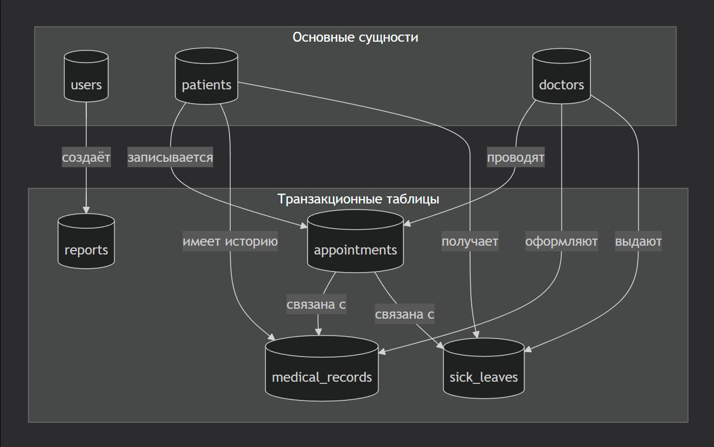

# Модель данных (Data Model)

## 1. Общая диаграмма связей (ER-диаграмма)

---

## 2. Описание таблиц

### 2.1. Таблица `users` (Пользователи системы)

Хранит учётные записи сотрудников для входа в систему.

| Поле | Тип | NULL | Описание |
| :--- | :--- | :--- | :--- |
| `id` | INT(11) | NO (PK) | Уникальный идентификатор |
| `username` | VARCHAR(50) | NO | Логин пользователя |
| `password_hash` | VARCHAR(255) | NO | Хэш пароля (password_hash) |
| `role` | ENUM('admin','doctor','registrar') | NO | Роль пользователя |
| `employee_id` | INT(11) | YES | ID сотрудника (связь с кадровой системой) |
| `created_at` | DATETIME | YES | Дата создания (CURRENT_TIMESTAMP) |

**Индексы:**
- `PRIMARY KEY (id)`
- `UNIQUE KEY (username)`

---

### 2.2. Таблица `patients` (Пациенты)

Хранит информацию о пациентах.

| Поле | Тип | NULL | Описание |
| :--- | :--- | :--- | :--- |
| `id` | INT(11) | NO (PK) | Уникальный идентификатор пациента |
| `full_name` | VARCHAR(150) | NO | Полное имя (Фамилия Имя Отчество) |
| `birth_date` | DATE | NO | Дата рождения |
| `gender` | ENUM('М','Ж') | NO | Пол |
| `phone` | VARCHAR(20) | YES | Контактный телефон |
| `address` | TEXT | YES | Адрес проживания |
| `policy_number` | VARCHAR(16) | YES | Номер полиса ОМС/ДМС |
| `snils` | VARCHAR(14) | YES | Номер СНИЛС |
| `created_at` | DATETIME | YES | Дата создания карточки |
| `updated_at` | DATETIME | YES | Дата последнего обновления |

**Индексы:**
- `PRIMARY KEY (id)`
- `UNIQUE KEY (policy_number)`
- `UNIQUE KEY (snils)`
- `INDEX (full_name)`
- `INDEX (birth_date)`

---

### 2.3. Таблица `doctors` (Врачи)

Хранит информацию о врачах.

| Поле | Тип | NULL | Описание |
| :--- | :--- | :--- | :--- |
| `id` | INT(11) | NO (PK) | Уникальный идентификатор врача |
| `full_name` | VARCHAR(150) | NO | Полное имя врача |
| `specialty` | VARCHAR(100) | NO | Специальность (терапевт, хирург и т.д.) |
| `cabinet` | VARCHAR(10) | YES | Номер кабинета |
| `work_schedule` | JSON | YES | Расписание работы (JSON формат) |
| `created_at` | DATETIME | YES | Дата добавления |

